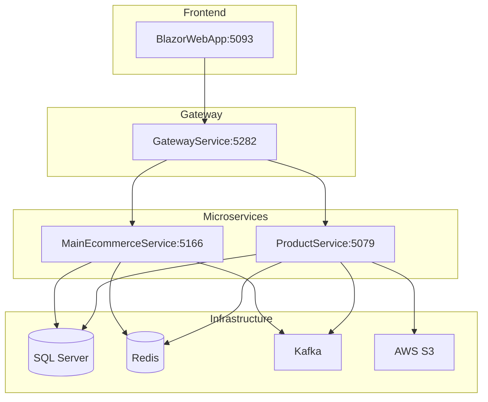

# DA_Ecommerce_MS - Distributed E-commerce Platform 🛒

[](https://dotnet.microsoft.com/)
[](https://blazor.net/)
[](https://microservices.io/)
[](https://docker.com/)

## 📋 Overview

**DA_Ecommerce_MS** is a modern distributed e-commerce platform built with **Microservices architecture** using **.NET 8.0**, **Blazor Server**, and **cloud-native** technologies. The system supports multi-role dashboards for **Admin**, **Seller**, **Shipper**, and **Customer**.

## 🏗️ System Architecture



## 🎯 Microservices

### 🌐 GatewayService (Port: 5282)
- **Purpose**: API Gateway với YARP reverse proxy
- **Features**: Request routing, authentication, CORS handling

### 🏪 MainEcommerceService (Port: 5166)
- **Database**: SQL Server (MainEcommerceService DB)
- **Core Features**:
  - 👤 User Management & Authentication
  - 📦 Order Processing & Tracking
  - 📍 Address Management
  - 🎫 Coupon System
  - 🏬 Seller & Shipper Management
  - 📊 Real-time Analytics
  - 🔔 SignalR Notifications

### 📦 ProductService (Port: 5079)
- **Database**: SQL Server (ProductService DB)
- **Core Features**:
  - 🛍️ Product CRUD Operations
  - 📂 Category Management
  - 🖼️ AWS S3 Image Storage
  - 🔍 Advanced Search & Filtering
  - ⚡ Redis Caching

### 🖥️ BlazorWebApp (Port: 5093)
- **Framework**: Blazor Server với MudBlazor UI
- **Features**: Responsive design, real-time updates, multi-role dashboards

## 🔧 Tech Stack

| Layer | Technology | Purpose |
|-------|------------|---------|
| **Frontend** | Blazor Server, MudBlazor | Server-side UI framework |
| **Backend** | .NET 8.0, EF Core, SignalR | Core services |
| **Gateway** | YARP | API Gateway & Routing |
| **Database** | SQL Server | Primary data store |
| **Cache** | Redis | Performance optimization |
| **Messaging** | Apache Kafka | Event streaming |
| **Storage** | AWS S3 | File storage |
| **Auth** | JWT Bearer | Authentication |
| **Container** | Docker Compose | Orchestration |

## 🎭 User Roles

### 👨‍💼 Admin Dashboard (`/admin`)
- User & role management
- System analytics & monitoring
- Order oversight & processing
- Seller approval & management

### 🛍️ Seller Dashboard (`/seller`)
- Product management & inventory
- Order processing & fulfillment
- Sales analytics & reports
- Store profile management

### 🚚 Shipper Dashboard (`/shipper`)
- Delivery assignment & tracking
- Route optimization
- Performance metrics
- Real-time notifications

### 🛒 Customer Experience
- Product discovery & search
- Shopping cart & wishlist
- Checkout & payment
- Order tracking

## 🚀 Quick Start

### Prerequisites
```bash
- .NET 8.0 SDK
- Docker Desktop 4.0+
- 8GB RAM (16GB recommended)
```

### 1. Clone & Setup
```bash
git clone https://github.com/yourusername/DA_Ecommer_MS.git
cd DA_Ecommer_MS
```

### 2. Configure Environment
Create `.env` file in root directory:
```bash
# JWT Configuration
JWT_SECRET_KEY=YOUR_SUPER_SECRET_KEY_32_CHARACTERS_MIN
JWT_ISSUER=DA_Ecommerce_MS
JWT_AUDIENCE=ecommerce-users

# Database
SQL_SA_PASSWORD=YourStrong!Password123

# AWS (Optional)
AWS_ACCESS_KEY=your_aws_access_key
AWS_SECRET_KEY=your_aws_secret_key

# External Database Connections
EXTERNAL_DB_CONNECTION="Server=your_server;Database=MainEcomerceService;User Id=sa;Password=${SQL_SA_PASSWORD};TrustServerCertificate=True;"
EXTERNAL_PRODUCT_DB_CONNECTION="Server=your_server;Database=ProductService;User Id=sa;Password=${SQL_SA_PASSWORD};TrustServerCertificate=True;"
EXTERNAL_REDIS_CONNECTION="your_redis_server:6379"
```

### 3. Run with Docker
```bash
# Start all services
docker-compose up -d --build

# Check status
docker ps

# View logs
docker logs gateway_service
```

### 4. Access Services

| Service | URL | Description |
|---------|-----|-------------|
| **Frontend** | http://localhost:5000 | Blazor Web App |
| **API Gateway** | http://localhost:5282/swagger | Gateway Swagger |
| **Main API** | http://localhost:5166/swagger | Core API |
| **Product API** | http://localhost:5079/swagger | Product API |
| **Kafka UI** | http://localhost:8090 | Kafka Management |

## 📁 Project Structure

```
DA_Ecommer_MS/
├── 📁 AppHost/                     # .NET Aspire orchestration
├── 📁 BlazorWebApp/                # Blazor Server frontend
│   ├── 📁 Pages/Admin/             # Admin dashboard
│   ├── 📁 Pages/Seller/            # Seller dashboard  
│   ├── 📁 Pages/Shipper/           # Shipper dashboard
│   ├── 📁 Services/                # HTTP client services
│   └── 📁 ViewModel/               # Data transfer objects
├── 📁 GateWayService/              # YARP API Gateway
├── 📁 MainEcommerceService/        # Core business service
│   ├── 📁 Controllers/             # REST API controllers
│   ├── 📁 Infrastructure/Services/ # Business logic
│   ├── 📁 Models/                  # Entity models
│   ├── 📁 Hubs/                    # SignalR hubs
│   └── 📁 Kafka/                   # Event handlers
├── 📁 ProductService/              # Product management
│   ├── 📁 Controllers/             # Product APIs
│   ├── 📁 Infrastructure/Services/ # Product logic
│   └── 📁 Models/                  # Product entities
├── 🐳 docker-compose.yml           # Container orchestration
└── 📄 .env                        # Environment variables
```

## 🔌 Key API Endpoints

### Authentication APIs
```http
POST /main/api/UserLogin/LoginUser       # User login
POST /main/api/UserLogin/RegisterUser    # User registration
PUT  /main/api/UserLogin/Logout          # User logout
POST /main/api/UserLogin/RefreshToken    # Token refresh
```

### Product APIs
```http
GET    /product/api/products             # Get all products
POST   /product/api/products             # Create product
PUT    /product/api/products/{id}        # Update product
DELETE /product/api/products/{id}        # Delete product
```

### Order APIs
```http
GET  /main/api/Order/orders              # Get orders
POST /main/api/Order/CreateOrder         # Create order
PUT  /main/api/Order/{id}/status         # Update status
```

## 🌟 Key Features

### 🛒 E-commerce Core
- **Product Catalog**: Multi-category, advanced search, variants
- **Shopping Experience**: Cart, wishlist, comparison, recommendations
- **Checkout Process**: Multiple addresses, payment integration
- **Order Management**: Real-time tracking, status updates

### 📊 Real-time Features
- **Live Notifications**: Order updates, inventory alerts
- **Dynamic Updates**: Price changes, stock levels
- **SignalR Hubs**: Product, order, user notifications

### 🔐 Security & Performance
- **JWT Authentication**: Stateless tokens with refresh
- **Role-based Authorization**: Granular permissions
- **Redis Caching**: Product catalogs, sessions
- **Event-Driven**: Kafka messaging

## 🧪 Testing & Development

### Run Tests
```bash
# Unit tests
dotnet test

# Integration tests
dotnet test --filter "Category=Integration"
```

### Development Mode
```bash
# Run infrastructure only
docker-compose up -d kafka redis

# Run services from IDE
dotnet run --project AppHost
```

## 🚢 Deployment

### Docker Production
```bash
# Build production images
docker-compose -f docker-compose.prod.yml build

# Deploy
docker-compose -f docker-compose.prod.yml up -d
```

### Health Monitoring
- **Health Checks**: `/health`, `/health/ready`, `/health/live`
- **Metrics**: Response times, error rates, throughput
- **Logging**: Structured logging with Serilog

## 🤝 Contributing

1. Fork the repository
2. Create feature branch: `git checkout -b feature/amazing-feature`
3. Make changes with proper testing
4. Commit: `git commit -m 'Add amazing feature'`
5. Push: `git push origin feature/amazing-feature`
6. Create Pull Request

## 📞 Support

- **Issues**: [GitHub Issues](https://github.com/yourusername/DA_Ecommer_MS/issues)
- **Documentation**: [Project Wiki](https://github.com/yourusername/DA_Ecommer_MS/wiki)
- **API Docs**: Available at `/swagger` endpoints

## 📄 License

This project is licensed under the **MIT License**. See [LICENSE](LICENSE) file for details.

## 🙏 Acknowledgments

- **.NET Team** - Excellent development platform
- **MudBlazor** - Beautiful Blazor components  
- **Apache Kafka** - Reliable event streaming
- **YARP** - .NET reverse proxy

---

⭐ **If this project is helpful, please give us a Star!** ⭐

**Made with ❤️ by [NGUYEN CONG HUAN](https://github.com/huanop3)**

*Last updated: June 2025*
